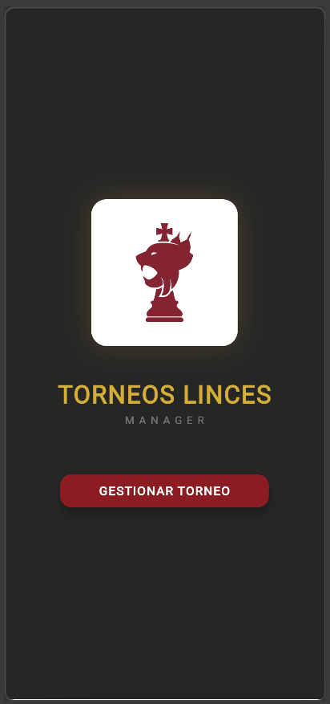
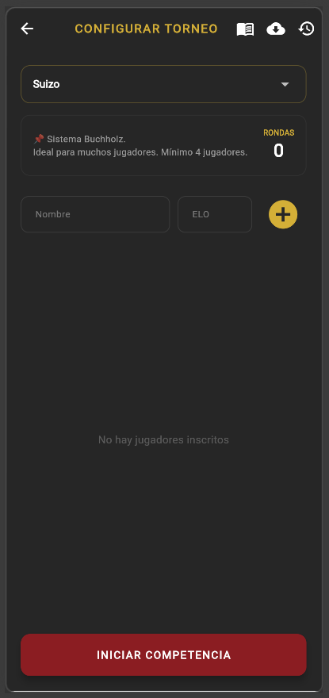
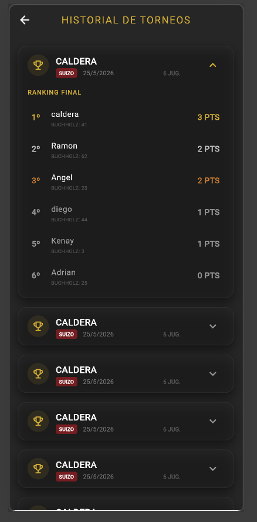

# Torneos Linces: Manager Pro ♟️
**Gestión profesional de torneos de ajedrez**

Herramienta desarrollada por encargo institucional del CECyTE Baja California, Plantel Mexicali. Diseñada, programada y desplegada por un alumno de 6° semestre de la carrera Técnico en Programación.
La escuela necesitaba una solución real para organizar sus competencias internas de ajedrez. La gestión manual de emparejamientos y el cálculo de desempates consumía tiempo y generaba errores durante los eventos. La respuesta fue esta aplicación: construida desde cero con Flutter y Firebase, automatiza todo el flujo de un torneo oficial, desde el registro de jugadores hasta la publicación del podio final con ranking ELO conforme a las reglas de la FIDE.

---

## Screenshots

<div align="center">

| Inicio | Configurar | Historial |
|--------|------------|-----------|
|  |  |  |

</div>

---

## Stack Tecnológico

| Capa | Tecnología |
|------|------------|
| Frontend | Flutter (Dart) |
| Base de datos | Cloud Firestore |
| Backend | Firebase |
| Plataformas | Android · iOS · Web |

---

## Funcionalidades

### Sistemas de Torneo
- **Sistema Suizo** — Emparejamiento dinámico por puntuación, desempate Buchholz
- **Round Robin** — Todos contra todos con Algoritmo de Berger, desempate Sonneborn-Berger
- **Eliminatoria Directa** — Llaves de cuadro, requiere potencia exacta de 2 participantes

### Ranking y Estadísticas
- Implementación completa del sistema de puntuación **ELO (FIDE)** con Factor K=32
- Cálculo automático de puntuación esperada y actualización post-partida
- Historial de torneos consultable guardado en Firestore

### Operación en Tiempo Real
- Sincronización de resultados con Cloud Firestore al cierre de cada ronda
- **Modo Offline** automático con caché local si la red escolar falla
- Carga rápida de jugadores registrados en torneos anteriores
- Bloqueo de mesas ya procesadas para evitar modificaciones accidentales

---

## Estructura de Datos (Firestore)

Colección: `torneos_resultados`

| Campo | Tipo | Descripción |
|-------|------|-------------|
| `fecha` | Timestamp | Fecha y hora de cierre del torneo |
| `tipo` | String | Formato (Suizo / Round Robin / Eliminatoria) |
| `ganador` | String | Nombre del primer lugar |
| `clasificacion` | Array (Maps) | Tabla final con puntos y desempates |
| `partidas` | List (String) | Historial de mesas (1-0, 0-1, ½-½) |

---

## Instalación

```bash
git clone https://github.com/lachicawired/torneos-linces.git
cd torneos-linces
flutter pub get
flutter run
```

> Requiere Flutter SDK y configuración de Firebase (`google-services.json` para Android).

---

## Equipo de Desarrollo

| Integrante | Rol |
|------------|-----|
| Jorge | Programador — Dart, Firebase, vistas principales |

---

## Desarrollado en

CECyTE Baja California — Plantel Mexicali  
Carrera: Técnico en Programación · 2026
